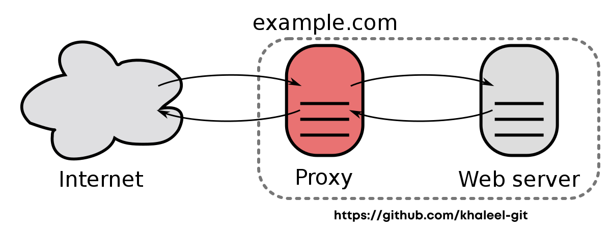

# Ngnix Reverse Proxy Setup
Nginx Reverse Proxy is a technique used to improve website security and manage web traffic. It involves using the Nginx server as a reverse proxy to hide the web server's actual IP address and balance website traffic across multiple servers, preventing server downtime and ensuring smooth website performance. 



You will need two servers. One server is for the Ngnix Reverse proxy. The other server is on which you are hosting your actual WordPress website.

## Server 1
1. Install Wordpress on any linux vps
2. Be sure, your wordpress website is acceible via ip-address
3. Do not redirect your domain: example.com to this wordpress server

## Server 2
1. Take ubuntu or any other linux VPS
2. Install Ngnix
3. Setup Ngnix configuration: https://github.com/khaleel-git/ngnix-reverse-proxy-wordpress-setup/blob/master/nginx.conf (Skip SSL block)
4. Point your domain to this ngnix server
5. Install SSL via lets encrypt built-in cert-bot: https://www.nginx.com/blog/using-free-ssltls-certificates-from-lets-encrypt-with-nginx/

# Issues
## 1. Ngnix Reverse Proxy Wordpress Too many redirect solution:
###  Delete this default block from wp-config.php (WordPress):

```
define('WP_HOME', 'http://example.com');
define('WP_SITEURL', 'http://example.com');
```

### Add the following block:

#### Either this will work
```
define('FORCE_SSL_ADMIN', true);
if (isset($_SERVER['HTTP_X_FORWARDED_PROTO']) && $_SERVER['HTTP_X_FORWARDED_PROTO'] == 'https') {
    $_SERVER['HTTPS'] = 'on';
}
```

#### Or only Adding this line will work. 
```
$_SERVER['HTTPS'] = 'On';
```

#### Adding both Blocks is recommended in most of the cases.
